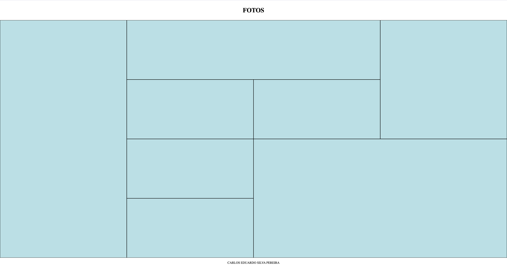

# galeria-grid.

## Descrição
Página de uma galeria grid usando HTML e CSS, desenvolvimento durante a disciplina de Linguagem de Marcação da escola SENAI Jandira. 

## Tecnologias
*HTML
*CSS
*git
& github

## Autor
[Carlos Eduardo](https://www.linkedin.com/in/carlos-eduardo-silva-pereira-a2413b353/)